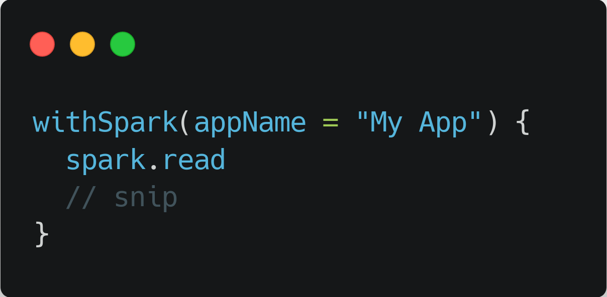
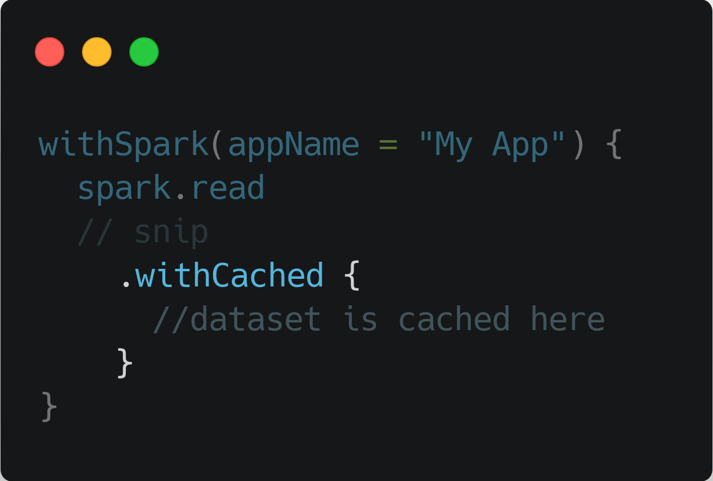

<!--
_class: lead
_paginate: false
_footer: ""
-->

# Kotlin for Apache Spark:
# Зачем миру ещё один API

Паша Финкельштейн, Виталий Худобахшов
JetBrains

---
<!--
_class: lead
-->

# <!-- fit --> На чём пишут под Spark?

---

<!--
_class: lead
-->

# <!-- fit --> Python

---

<!--
_class: lead
-->

# <!-- fit --> Java

---

<!--
_class: lead
-->

# <!-- fit --> Scala

---

# А ещё

- R (два API)
- C#
- Haskell
- JS (with GraalVM)
- *YouNameIt*

---

<!--
_class: lead
-->

# <!-- fit --> Кто использует

---

# Кто использует

- Дата иженеры
- Дата аналитики
- Дата саентисты

Для всех кроме дата инженеров Python — популярный выбор

---

<!--
_class: lead
-->

# <!-- fit --> Почему Python?

---

<!--
_class: lead
-->

# <!-- fit --> А почему бы и нет?

---

<!--
_class: lead
-->

# <!-- fit --> А что там насчёт R?

---

<!--
_class: lead
-->

# <!-- fit --> А если мы уже пишем на Java?

---

<!--
_class: lead
-->

# <!-- fit --> А что не так со Scala?

---

<!--
_class: lead
-->

# <!-- fit --> Если всё устраивает — всё так!

---
<!--
_class: lead
-->

Просто `sum` не работает

---
<!--
_class: lead
-->

Есть в стандатной библиотеке

---
<!--
_class: lead
-->
# Type-safe builders

---
<!--
_class: lead
-->

---

<!--
_class: lead
-->

---

<!--
_class: lead
-->

---

<!-- _class: lead -->

---
<!-- _class: lead -->

# <!-- fit --> Что было сложно

---

# Что не работает

- Поддержка массивов
- UDF не всегда
- Spark 2 (уже скоро)

---

<!-- _class: lead -->

# <!-- fit --> ki-shell

[Kotlin/kotlin-interactive-shell](https://github.com/Kotlin/kotlin-interactive-shell)

---

# Итоги

- Kotlin подходит для дата инжинеров!
- Может работать как первый язык
- Его поддерживает наша любимая IDE

---
<!-- _class: lead -->
# <!-- fit --> Спасибо!

[JetBrains/kotlin-spark-api](https://github.com/JetBrains/kotlin-spark-api)