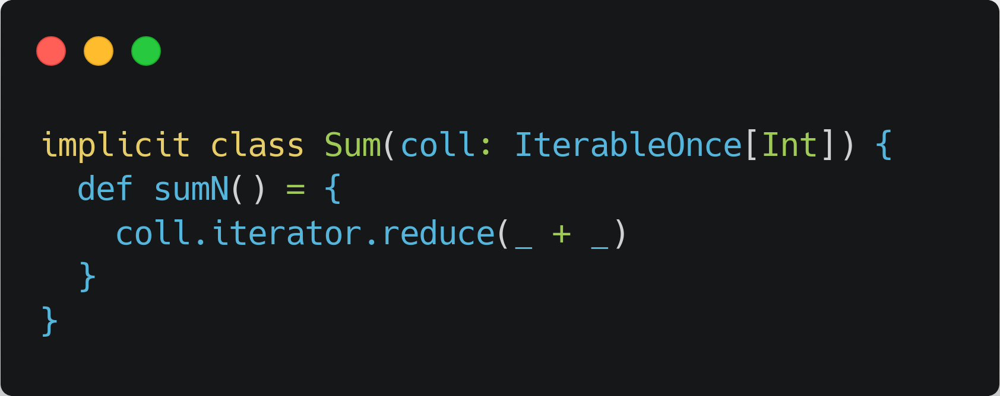
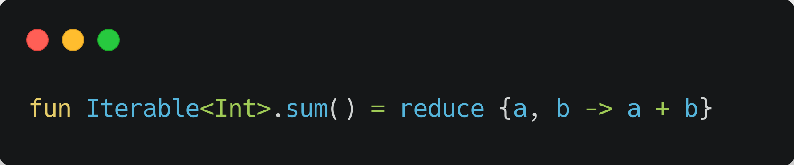
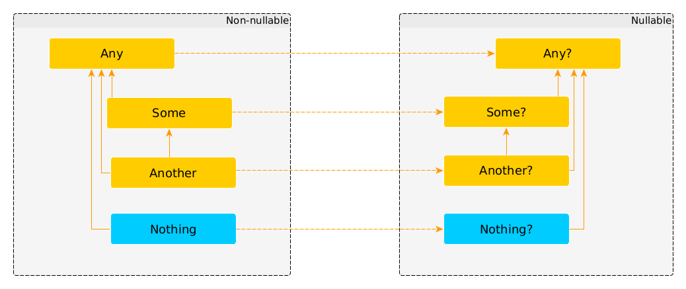
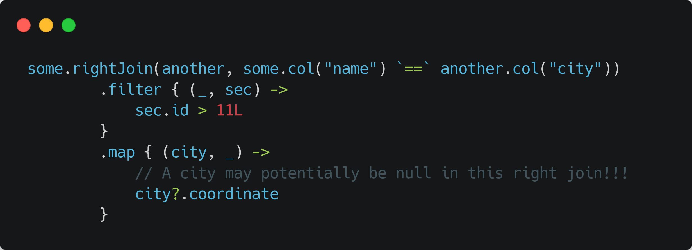

<!--
_class: lead
_paginate: false
_footer: ""
-->

# Kotlin for Apache Spark:
# Зачем миру ещё один API

---
<!--
_class: lead
-->

# <!-- fit --> На чём пишут под Spark?

---

<!--
_class: lead
-->

# <!-- fit --> Python

---

<!--
_class: lead
-->

# <!-- fit --> Java

---

<!--
_class: lead
-->

# <!-- fit --> Scala

---

# А ещё

- R (два API)
- C#
- Haskell
- JS (with GraalVM)
- *YouNameIt*

---

<!--
_class: lead
-->

# <!-- fit --> Кто использует

---

# Кто использует

- Дата иженеры
- Дата аналитики
- Дата саентисты

Для всех кроме дата инженеров Python — популярный выбор

---

<!--
_class: lead
-->

# <!-- fit --> Почему Python?

---

<!--
_class: lead
-->

# <!-- fit --> А почему бы и нет?

---

<!--
_class: lead
-->

# <!-- fit --> А что там насчёт R?

---

<!--
_class: lead
-->

# <!-- fit --> А что не так со Scala?

---

<!--
_class: lead
-->

# <!-- fit --> Если всё устраивает — всё так!

---
<!--
_class: lead
-->

Просто `sum` не работает

---
<!--
_class: lead
-->

Есть в стандатной библиотеке

---
<!--
_class: lead
-->

---

<!--
_class: lead
-->

